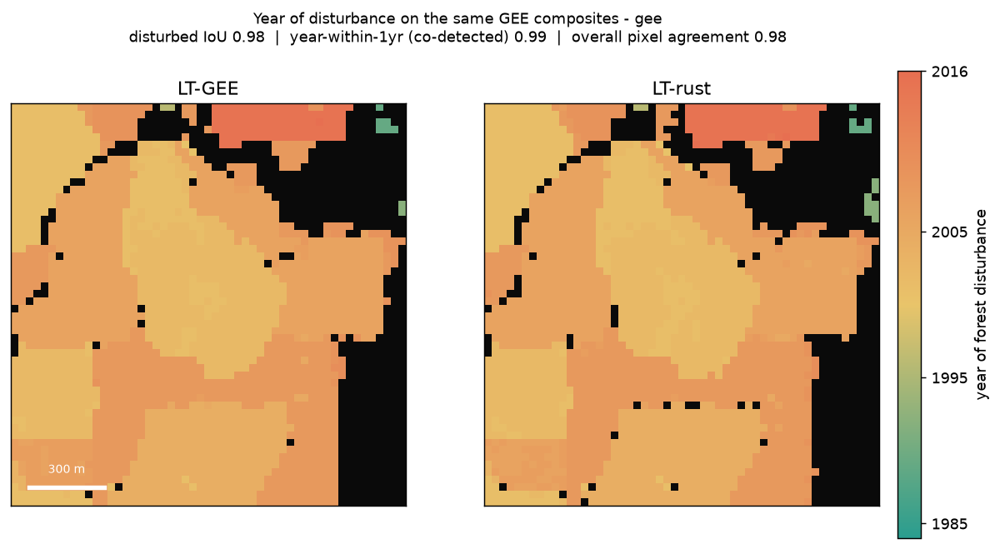
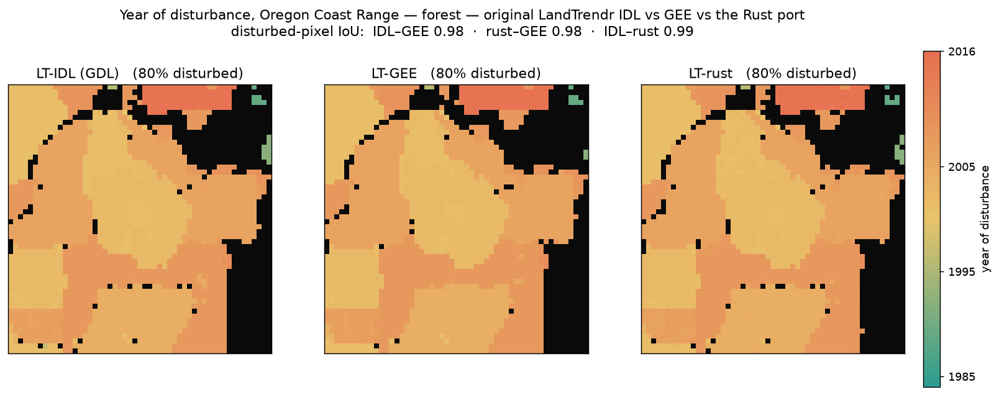

# LT-rust

A Rust implementation of **LandTrendr** (Kennedy et al. 2010), alongside LT-IDL and
LT-GEE. A pixel's annual spectral-index trajectory goes in; the fitted trajectory and
disturbance/recovery breakpoints come out. The same kernel runs locally, in a Python
worker, or in the browser via WASM.

## Install

Prebuilt wheels (CPython ≥3.10, incl. 3.14) are attached to each
[release](../../releases) — no Rust toolchain needed:

```bash
pip install LT-rust --find-links https://github.com/nthh/LT-rust/releases/latest
```

## Use

```python
import numpy as np, lt_rust as lt

nbr   = np.array([...], dtype=np.float32)        # one annual value per year (NaN = gap)
years = np.arange(1984, 2017, dtype=np.int32)

fitted, is_vertex, rmse = lt.landtrendr_pixel(nbr, years)   # LT-GEE default runParams
breakpoints = years[is_vertex.astype(bool)]
```

Every `LandTrendr.js` runParam is a keyword with the same name and default
(`max_segments=6`, `spike_threshold=0.9`, `recovery_threshold=0.25`,
`p_value_threshold=0.05`, `best_model_proportion=0.75`, `min_observations_needed=6`,
`vertex_count_overshoot=3`, `prevent_one_year_recovery=True`). For a whole raster
stack, use `lt.landtrendr_flat(...)`.

Two raster functions feed the eMapR forest-loss ensemble:
`lt.landtrendr_ftvdiff_flat(data, n_pixels, n_years, years, target_year)` is the
per-year FTV-diff loss signal (eMapR `getLtFtvDiff`), and
`lt.landtrendr_loss_window(..., target_year, half_window)` sums loss over a window
for higher recall when a disturbance is fit as a multi-year ramp. All four take the
same runParam keywords.

## Validated against native GEE

Fed the same source series, the Rust fit tracks Earth Engine's LandTrendr and lands the
disturbance vertex on the same year — here on the LT-GEE Fig 2.1 example pixel
(−123.845, 45.889): mature conifer, clearcut in 2001, regrowth to 2016.


```bash
pip install -r python/requirements.txt
python python/fetch_nbr.py     # Landsat annual NBR composites from cloud-native COGs
python python/gee_truth.py     # native GEE LandTrendr reference (needs an EE account)
python python/compare.py       # overlay + vertex agreement -> compare_gee_vs_rust.png
```

### Raster scale, across land covers

Beyond the single pixel, we run GEE LandTrendr and the Rust kernel on the **same**
GEE annual composites over small AOIs and compare the per-pixel year of greatest
disturbance. Agreement tracks the LT-GEE paper's own LT-GEE-vs-LT-IDL comparison
(Kennedy et al. 2018, Table 2: 90–94% in forest) and reproduces its land-cover
pattern: forest agrees closely, cropland and arid are harder (the despike-sensitive
cases the paper's two implementations also diverged on).

| site | land cover | overall pixel agreement | disturbed IoU | year-within-1yr |
|---|---|---|---|---|
| Oregon Coast Range | forest | 0.98 | 0.98 | 0.99 |
| central Iowa | cropland | 0.95 | 0.61 | 0.97 |
| northern Nevada | shrub / arid | 1.00 | n/a (no events) | n/a |



```bash
EE_PROJECT=<proj> python python/gee_dist_map.py  # GEE LandTrendr -> source + disturbance-year GeoTIFFs (edit AOI at top)
python python/compare_maps.py                     # Rust on the same composites -> two-panel map + agreement
```

Forest sits at the paper's bar. Cropland's disturbed-pixel IoU drops (sparse, noisy
harvest signals) while overall agreement stays high; arid shrub has no disturbance
to find in either, so the two agree completely.

## Validated against the original LT-IDL

GEE is itself a translation of the original IDL LandTrendr, so the *source* algorithm
is the stronger reference. `python/idl_compare.py` runs the unmodified LandTrendr-2012
IDL (`fit_trajectory_v2` → `tbcd_v2`) under [GNU Data Language](https://github.com/gnudatalanguage/gdl)
on the same series. On the 5 GEE-truth pixels, **LT-IDL and LT-GEE agree on every
vertex (5/5), mean fitted MAE 2.1 NBR×1000** — confirming GEE faithfully tracks IDL,
and giving a white-box reference to debug the port against (every fix below was found
by diffing rust against IDL stage by stage). The three-panel maps
(`python/idl_vs_gee_vs_rust_map.py`) put all three side by side per scene:

| scene | IoU IDL–GEE | IoU rust–GEE | IoU IDL–rust |
|---|---|---|---|
| forest | 0.98 | 0.98 | 0.99 |
| cropland | 0.69 | 0.61 | 0.67 |
| arid | — (no events) | — | — |



On cropland even IDL and GEE only agree at 0.69 — annual harvest cycles are marginal
signals for LandTrendr — and LT-rust tracks IDL to 0.67, near that intrinsic ceiling.
The harness needs the GDL app and the LandTrendr-2012 source on the GDL path; see
`idl-harness/` for the two shim routines (`regress`, `f_test1`) the headless GDL build omits.

## Optional: GDAL-free data access

`fetch_nbr.py` reads Landsat via rasterio. `fetch_nbr_lazycogs.py` does the same with
**no GDAL** (rustac + lazycogs + obstore), producing byte-identical composites — needs
Python 3.13 (lazycogs segfaults on 3.14).

## Build from source

Needs the Rust toolchain ([`rustup`](https://rustup.rs)) and `maturin`. The `python`
feature enables the PyO3 bindings; abi3 builds a single wheel per platform.

```bash
pip install maturin
maturin develop --features python     # compile + install into the active venv
python python/compare.py              # validate against the bundled GEE reference

# or build a wheel without installing:
maturin build --release --features python --out dist
```

## Faithfulness to the original algorithm

This kernel is a faithful port of the original LandTrendr-IDL algorithm, validated
stage by stage against the real IDL run under GNU Data Language (see *Validated
against the original LT-IDL* above). The pieces that matter are ported, not
approximated:

- **Fitting:** sequential anchored point-to-point regression (`find_best_trace` +
  `anchored_regression`) — the IDL primary fit, not a simultaneous solve.
- **Vertex culling:** the `angle_diff` importance metric with its disturbance
  weighting, so disturbance and recovery vertices are protected from removal.
- **Model selection:** `pick_best_model6` over a per-model F-test vs a flat line
  (exact incomplete-beta F CDF) with the collapse-to-flat rule for non-significant
  fits; the candidate ladder uses `take_out_weakest2` (recovery-violator first, else
  least local MSE, with the in-place point interpolation).
- **Despiking:** the iterative `desawtooth`.

The remaining differences are at the floating-point floor — this is not a bit-exact
port (f32 vs IDL's f64, accumulation order) — surfacing only as a few marginal pixels
in noise-only scenes, not as an algorithmic gap.

## References

- Kennedy, R.E., Yang, Z., Cohen, W.B. (2010). Detecting trends in forest disturbance
  and recovery using yearly Landsat time series: 1. LandTrendr — Temporal Segmentation
  Algorithms. *Remote Sensing of Environment* 114(12), 2897–2910.
  [doi:10.1016/j.rse.2010.07.008](https://doi.org/10.1016/j.rse.2010.07.008)
- Kennedy, R.E. et al. (2018). Implementation of the LandTrendr Algorithm on Google
  Earth Engine. *Remote Sensing* 10(5), 691.
  [doi:10.3390/rs10050691](https://doi.org/10.3390/rs10050691)

## License

MIT
